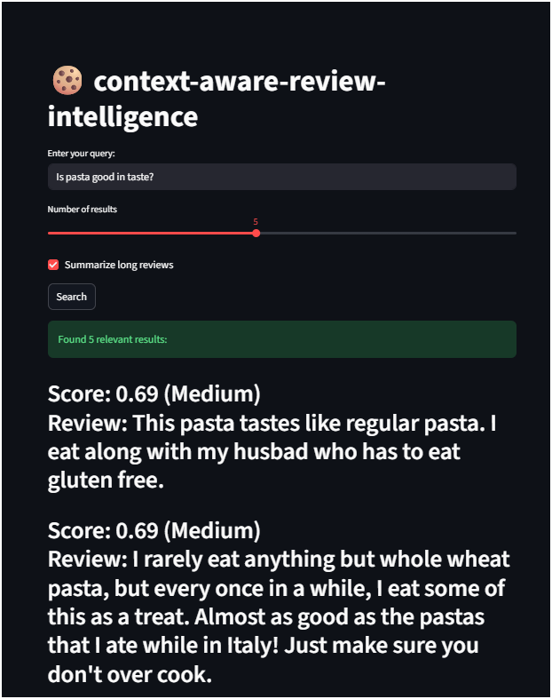

# 🔍 Insight Search Engine

A semantic search system that enables meaning-based retrieval of user reviews using dense vector embeddings and vector similarity search.

This project demonstrates an end-to-end pipeline including text preprocessing, embedding generation using Sentence Transformers, vector indexing with Pinecone, and a Streamlit-based web interface for real-time querying.

---

## 🚀 Features

- Semantic (meaning-based) search over text data
- Dense vector embeddings using Sentence Transformers
- Fast vector similarity search with Pinecone
- Cosine similarity with relevance filtering
- Lightweight model optimized for low-resource systems
- Streamlit-based interactive UI
- Query and result logging

---

## 🧰 Tech Stack

- Python  
- Sentence Transformers (all-MiniLM-L6-v2)  
- Pinecone (Vector Database)  
- Streamlit  
- Pandas, Regex, TQDM  

---

## 🏗️ Architecture Overview

User Query
↓
Text Cleaning
↓
Embedding Generation
↓
Vector Similarity Search (Pinecone)
↓
Relevance Filtering
↓
Streamlit UI Output

## 📂 Dataset

Due to GitHub file size limits, the dataset is not included in this repository.

You can download the Amazon Reviews dataset from:

https://www.kaggle.com/datasets/snap/amazon-fine-food-reviews

After downloading, place `Reviews.csv` inside the project root or `data/` folder.
